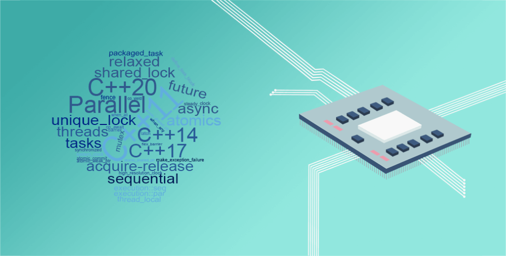

# C++多线程编程



1.派生4个线程，分别打印问候消息：
```cpp
#include <iostream>
#include <vector>
#include <cstdint>
#include <thread>

using namespace std;

void say_hello(uint64_t id) {
    cout << "Hello from thread: " << id << endl;
}

int main() {
    const uint64_t num_threads = 4;
    vector<thread> threads;
    for (uint64_t id = 0; id < num_threads; id++) {
        threads.emplace_back(say_hello, id);
    }
    for (auto& thread : threads) {
        thread.join();
    }
    return 0;
}
```

2.迭代计算第n个Fibonacci数的基本函数模板
```cpp
template <typename value_t, typename index_t> value_t fibonacci(value_t n) {
    value_t a_0 = 0;
    value_t a_1 = 1;
    for (index_t index = 0; index < n; index++) {
        const value_t temp = a_0;
        a_0 = a_1;
        a_1 += temp;
    }
    return a_0;
}
```

3.通过为每个数派生一个线程并发地计算Fibonacci数列，把结果传递给主线程：
```cpp
#include <iostream>
#include <vector>
#include <cstdint>
#include <thread>

using namespace std;

template <typename value_t, typename index_t> void fibonacci(value_t n, value_t *result) {
    value_t a_0 = 0;
    value_t a_1 = 1;
    for (index_t index = 0; index < n; index++) {
        const value_t temp = a_0;
        a_0 = a_1;
        a_1 += temp;
    }
    *result = a_0;
}

int main() {
    const uint64_t num_threads = 32;
    vector<thread> threads;
    vector<uint64_t> results(num_threads, 0);
    for (uint64_t id = 0; id < num_threads; id++) {
        threads.emplace_back(fibonacci<uint64_t, uint64_t>, id, &(results[id]));
    }
    for (auto& thread : threads) {
        thread.join();
    }
    for (const auto& result : results) {
        cout << result << endl;
    }
    return 0;
}
```

4.添使用promise和future进行异步通信：
```cpp
#include <iostream>
#include <cstdint>
#include <vector>
#include <thread>
#include <future>

using namespace std;

template <typename value_t, typename index_t> void fibonacci(value_t n, promise<value_t> &&result) {
    value_t a_0 = 0;
    value_t a_1 = 1;
    for (index_t index = 0; index < n; index++) {
        const value_t temp = a_0;
        a_0 = a_1;
        a_1 += temp;
    }
    result.set_value(a_0);
}

int main() {
    const uint64_t num_threads = 32;
    vector<thread> threads;
    vector<future<uint64_t>> results;
    for (uint64_t id = 0; id < num_threads; id++) {
        promise<uint64_t> promise;
        results.emplace_back(promise.get_future());
        threads.emplace_back(fibonacci<uint64_t, uint64_t>, id, move(promise));
    }
    for (auto& result : results) {
        cout << result.get() << endl;
    }
    for (auto& thread : threads) {
        thread.join();
    }
    return 0;
}
```

5.在同一个容器中存储几个封装不同函数的任务，函数又有不同的实际参数，通过一个自制的任务工厂实现：
```cpp
#include <iostream>
#include <future>
#include <functional>

using namespace std;

template<typename Func, typename ...Args, typename Rtrn = typename result_of<Func(Args...)>::type> auto make_task(Func &&func, Args &&...args) -> packaged_task<Rtrn(void)> {
    auto aux = bind(forward<Func>(func), forward<Args>(args)...);
    auto task = packaged_task<Rtrn(void)>(aux);
    return task;
}
```

6.在自制的make_task工厂实现一个线程池，在队列中维护这些任务：
```cpp
#include <iostream>
#include <cstdint>
#include <vector>
#include <thread>
#include <future>
#include <functional>

using namespace std;

template<typename Func, typename ...Args, typename Rtrn = typename result_of<Func(Args...)>::type> auto make_task(Func &&func, Args &&...args) -> packaged_task<Rtrn(void)> {
    auto aux = bind(forward<Func>(func), forward<Args>(args)...);
    auto task = packaged_task<Rtrn(void)>(aux);
    return task;
}

uint64_t fibonacci(uint64_t n) {
    uint64_t a_0 = 0;
    uint64_t a_1 = 1;
    for (uint64_t index = 0; index < n; index++) {
        const uint64_t temp = a_0;
        a_0 = a_1;
        a_1 += temp;
    }
    return a_0;
}

int main() {
    const uint64_t num_threads = 32;
    vector<thread> threads;
    vector<future<uint64_t>> results;
    for (uint64_t id = 0; id < num_threads; id++) {
        auto task = make_task(fibonacci, id);
        results.emplace_back(task.get_future());
        threads.emplace_back(move(task));
    }
    for (auto& result : results) {
        cout << result.get() << endl;
    }
    for (auto& thread : threads) {
        thread.detach();
    }
    return 0;
}
```

7.async异步方式：
```cpp
#include <iostream>
#include <cstdint>
#include <vector>
#include <future>

using namespace std;

uint64_t fibonacci(uint64_t n) {
    uint64_t a_0 = 0;
    uint64_t a_1 = 1;
    for (uint64_t index = 0; index < n; index++) {
        const uint64_t temp = a_0;
        a_0 = a_1;
        a_1 += temp;
    }
    return a_0;
}

int main() {
    const uint64_t num_threads = 32;
    vector<future<uint64_t>> results;
    for (uint64_t id = 0; id < num_threads; id++) {
        results.emplace_back(async(launch::async, fibonacci, id));
    }
    for (auto& result : results) {
        cout << result.get() << endl;
    }
    return 0;
}
```
